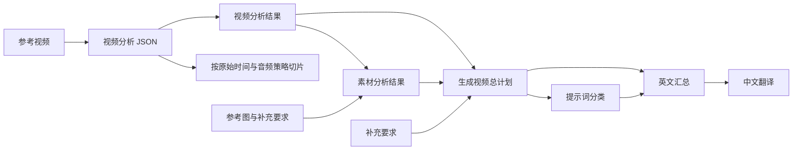

# Omni 流程复核

核对日期：2026-09-09。已核对说明文档及实际表的 7 个字段捷径全文。本文记录来源核对与已实现的七阶段流程，运行代码已接通；真实模型效果仍需使用配置有效的渠道和实际素材验证。

## 结论

迁入网站后，视频分析 JSON 应由网站根据上传的原视频生成，并交给用户查看、修改、复制和下载。要求用户先去外部生成 JSON 再导入，只适合作为兼容入口。

原教程中这一环由飞书自动化调用豆包完成，Codex 负责依据 JSON 切片与处理音频。将视频生成留在外部 Omni，不意味着上游视频分析也必须移到外部。

## 三份来源的分工

| 来源 | 核对内容 | 对网站流程的含义 |
| --- | --- | --- |
| [Codex+Omni 测试案例——方法论总结](https://ocn18sf3pb4v.feishu.cn/base/ZxmYbuEfeaY97GsdjZtcv96Bnt0?table=ldxBRflDKYe3MhJH) | 原视频定义镜头、动作与互动；产品、人物和背景图分别定义替换对象。原片只有局部身体时只替换可见部分。无包装盒的原产品不宜加入包装盒，产品图优先白底。 | 视频分析必须基于原片；不能把产品图用于臆造原片动作，也不能把产品图的背景误当目标场景。 |
| [3 套电商流程——配置与使用教程](https://ocn18sf3pb4v.feishu.cn/base/ZxmYbuEfeaY97GsdjZtcv96Bnt0?table=ldxlQt0RSOjWT5VF)，“六、Omni 不限时长流程” | 飞书生成视频分析 JSON、总计划、每段提示词；Codex 按 `start/end` 切片，并根据 `audio_strategy` 处理音频。 | 网站承接原先飞书负责的分析与提示词生成。 |
| [最新电商流程——0712 优化](https://ocn18sf3pb4v.feishu.cn/base/ZxmYbuEfeaY97GsdjZtcv96Bnt0?table=ldxN7wWvZL2HEVGl)，“二、Omni 不限时长流程” | 素材全部上传后触发分析；生成 JSON 后切片并处理音频，此轮到此结束。后续素材分析、提示词由用户在飞书手动触发。 | 分析、切片与后续提示词生成应分步触发，不应把所有步骤隐藏在一次素材准备中。 |

最初三个链接均解析为 Base 内嵌 Docx。用户随后提供了[实际 Omni 表](https://ocn18sf3pb4v.feishu.cn/base/ZxmYbuEfeaY97GsdjZtcv96Bnt0?table=tblBlQu3fCuvFSCP&view=vew8uZWaA0)，已通过浏览器读取字段捷径原文，没有修改飞书。

## 实际字段配置与依赖

完整原文、字段 ID、引用关系、字数及 SHA-256 保存在 [omni-remake-field-prompts.source.json](./omni-remake-field-prompts.source.json)。共 7 份指令、49,052 个字符，保留编辑器中的原始换行与零宽字符，不包含账号凭据。

| 顺序 | 字段 | 指令字符数 | 输入依赖 | 输出 |
| --- | --- | ---: | --- | --- |
| 1 | 视频分析Json | 8,147 | 参考视频 | 原始嵌套 JSON |
| 2 | 视频分析结果 | 2,375 | 视频分析Json | 保留完整信息的易读文本 |
| 3 | 素材分析结果 | 7,657 | 视频分析结果、产品/人物补充、产品图、人物图、背景图 | 素材关系与替换分析文本 |
| 4 | 生成视频总计划 | 8,969 | 视频分析结果、素材分析结果、产品/人物补充 | 分段生成计划文本 |
| 5 | 视频生成片段——提示词分类 | 1,224 | 生成视频总计划 | 片段分类文本 |
| 6 | 视频提示词-汇总 | 20,299 | 生成视频总计划、视频生成片段——提示词分类 | 总览表与各类型英文提示词 |
| 7 | 视频提示词-中文 | 381 | 视频提示词-汇总 | 逐句中文翻译，跳过总览表 |

七个字段均配置“小蚁多模态大模型（视频理解）”捷径，模型为 `Doubao Seed 2.0 Pro`，思考强度 `medium`，联网与显示思考过程关闭。每个字段的“自动更新”开关当前均关闭。只有分析 JSON 字段绑定原视频；只有素材分析字段绑定产品、人物、背景三类图片，其余字段通过文本结果衔接。



网站分别保存上述 7 份独立结果。分类必须先于英文汇总；同类型多个片段共用一条提示词，并保留片段与类型的映射。其余 6 个字段原生输出文本，不能将它们表述为飞书的 JSON 输出。

## 网站已实现的主流程

1. **上传素材。** 原视频提供实际镜头和动作；产品图提供替换目标；人物图、场景图按是否替换选择。保留补充要求和音频覆盖选项。
2. **分析原视频，输出 JSON。** 使用支持完整视频理解的已配置模型，输出时间段、画面描述、人物可见情况、说话判断和音频策略。页面同时展示易读片段列表及完整 JSON；分析指令也应可查看、修改。
3. **采用分析并切片。** 校验时间连续、无重叠、覆盖完整时长、单段不超过 10 秒，再按每段时间和音频策略生成真实视频片段。需要复核的片段明确标记。除用户明确选择音频覆盖策略外，执行器遵守分析 JSON 的最终策略，不静默重判。
4. **依次生成素材分析、总计划、分类、英文汇总、中文翻译。** 各步骤独立触发、保存结果并展示可编辑的完整生成指令。总计划只整合已有分析；英文汇总按分类组织同类片段共用提示词；中文步骤逐句翻译英文结果。每段单独选择对应参考图，原模板上限为 5 张。
5. **下载交付包。** 包含分析 JSON、总计划、每段提示词、参考图、处理过音频的源片段及素材清单；未生成最终视频时就可下载。
6. **在支持原视频编辑的外部 Omni 中逐段生成。** 每段使用源视频、对应参考图和提示词。具体渠道必须支持原视频输入；不能用仅支持图片输入的接口替代这一步。
7. **回传与合并。** 回传各段结果，校验片段归属、当前素材版本和时长后合并。已有手动回传、版本校验及音轨处理可复用。

导入外部 JSON 保留为高级入口。原片分析、提示词计划和最终视频应有各自的生成动作与状态。

## 三类 JSON 必须分清

| 产物 | 产生时机 | 用途 |
| --- | --- | --- |
| 视频分析 JSON | 看完原视频后 | 描述原片事实，决定如何分段、保留或移除音频；这是用户现在缺少的前置产物。 |
| 兼容入口的提示词计划 JSON | 导入旧网站计划时 | 保留旧项目导入；新主流程独立保存 6 份文本中间结果。模型传输采用 resultText 包装正文，并附带共享提示词索引，这不是飞书原生输出格式。 |
| `manifest.json` | 打包时 | 记录片段、文件和参考素材的对应关系。它是程序生成的清单，不代表模型已经分析过视频。 |

以下按教程字段及已留存的旧源表样本演示分析 JSON 的核心结构，假设原片长 8 秒；不是本次真实素材的分析结果；导入时仍须与上传原片的实际时长匹配。真实的时间、画面和音频判断必须来自上传的视频。

```json
{
  "video_summary": {
    "duration_seconds": 8,
    "total_segments": 1,
    "overall_scene": "示例：单人持产品讲解"
  },
  "segments": [
    {
      "segment_id": "S01",
      "start": 0,
      "end": 8,
      "duration": 8,
      "scene_description": "示例：室内场景，人物正面入镜",
      "main_action": "示例：人物持产品讲解",
      "person_info": {
        "person_visible": true,
        "person_count": 1,
        "person_list": [
          {
            "person_label": "person_A",
            "visible_range": "upper_body",
            "mouth_visible": true,
            "mouth_movement_status": "speaking",
            "mouth_movement_evidence": "示例：嘴部持续开合"
          }
        ]
      },
      "audio_judgement": {
        "audio_strategy": "keep_audio",
        "audio_strategy_reason": "示例：单人且有清晰说话口型",
        "needs_lip_sync": true,
        "needs_second_check": false,
        "second_check_reason": ""
      }
    }
  ]
}
```

网站不应让普通用户手写这些字段。JSON 是系统分析的交付结果，片段列表负责让用户直观核对和调整。

## 实现位置与保存规则

- `web/src/lib/omni-remake-field-prompts.json`：七份完整默认指令，保留来源字段 ID 与摘要；所有阶段在页面可查看、编辑、保存和恢复默认。
- `web/src/lib/omni-remake-analysis.ts`：兼容原表嵌套 JSON 与旧网站扁平 JSON，校验真实时长、连续覆盖、片段编号和音频统计，保留原始 JSON 与复核依据。
- `web/src/lib/omni-remake-workflow.ts`：七阶段依赖、输入字段、提示词分组和中英文映射；分类先于英文汇总，同组实际音频、人物范围及产品策略必须一致，每组最多 5 张参考图。
- `web/src/lib/server/omni-remake-runtime.ts` 与 `omni-remake-video-understanding.ts`：原视频上传后由分析模型生成 JSON，其他六步独立调用和保存，只有素材分析发送启用图片。当前整段视频理解支持配置有效的 `doubao-seed-2-0-pro-260215` Files / Responses 渠道；选择不支持的模型会明确报错，不静默改用别的模型。后续文本/视觉阶段遵循所选模型与渠道能力。
- `web/src/lib/server/omni-remake-project-service.ts`：原片或分析指令变化清除全链；参考图、替换选项及补充要求变化从素材分析开始清除；各阶段指令或采用结果变化从该阶段清除。音频覆盖保留原 JSON、重新应用策略并移除旧切片。只修改后续文字不会删除源切片。切换模型影响下一次生成，既有结果保留。
- `web/src/app/(user)/omni-remake/[id]/workspace.tsx`：上传先保存成功再自动分析，未配置模型时保留已上传素材并提示重试。后续步骤逐个触发；前五步结果支持编辑采用，英文汇总与中文译文保留完整正文并可复制、下载。最终提示词在片段中编辑，同步更新整个共享组和汇总，并清除该组旧回传结果。
- `web/src/app/api/omni-remake/projects/[id]/export/route.ts`：`format=analysis` 独立下载分析 JSON，`format=workflow` 下载七阶段指令和结果，无需切片。完整 ZIP 包含七份指令、七份结果及按片段选图的 manifest。

生成期间禁止并发改项目；失败保留已保存结果。保存采用 revision、操作 ID 和回传版本校验，过期结果不会写回。指令或结果草稿未保存时，页面阻止其他依赖操作，保存失败不启动生成。

本次实现范围是“Omni 全品类复刻”；服装流程保持原有能力，不将 FFmpeg 镜头变化检测表述为语义视频分析。
## 原表规则与需要明确适配的边界

- 最终英文提示词禁止自行编写动作序列、动作时间线或动作步骤，动作由源视频提供。新流程已使用完整原表指令并增加一致性要求，旧简化模板仅保留兼容函数；详细动作分析仍保留在上游结果中。
- 素材分析与计划需要保留人物匹配、产品部件数量、产品状态、包装与内部产品两个对象、逐段参考图选择和待确认项。不能把项目的所有参考图统一提交给所有片段。
- 分类原文确实止于空的“# 组合判断逻辑”标题。已在浏览器移至末尾再次读取，并以截图核对 1,224 字长度；不是只抓取了前半段。原文按现状留存，迁移时需要补足可验证的组合规则。
- 计划中的“锁定产品（不替换）”与分类中的“保持原样”需要同义归一。有人物且换品不能自动推导为换人；没有人物参考图时必须保留原人物。
- “换背景”分类与换品／换人可能重叠，其固定静音模板也可能与分析 JSON 的 `keep_audio` 相冲突。逐段实际产品、人物、背景和音频策略应作为执行依据，类型号仅负责组织和复用提示词。
- 分析文本中的时间格式示例存在舍入差异，切片始终使用原始 JSON 中的数值。总计划还应显式继承包装产品与内部产品特征，供英文汇总正确引用。

## 验证与边界

- 已读取三份远端文档的相关章节，并对照当前 UI、API、runtime、解析器及导出实现。
- 已逐项读取实际表 7 个字段捷径的完整输入指令、字段引用、图片／视频绑定、模型和开关设置，每次均取消退出，没有执行字段更新。
- 公开 `field-extension-get` 返回 `null`，原因是当前接口不能识别该第三方捷径，不代表没有指令。公开 `workflow-list` 返回 0 个流程，不能据此断言所有旧版自动化均不存在；本次确认的是字段自身“自动更新”关闭。
- JSON 嵌套字段核对使用已留存的旧源表实际记录 `.workflow/omni-remake-source-20260908.ndjson:2`、`:3`；没有将其描述为本次新 Base 的实时案例数据。
- 未提供本次待处理的视频和产品素材，因此没有生成或声称生成真实的视频分析 JSON。
- 已改运行代码，使用模拟调用验证七阶段、保存、失效与导出。未修改真实渠道配置，未调用付费模型，未部署，未创建 Git 提交。

### 本地实现验证

- 全量 TypeScript 检查、所有本次修改文件的定向 ESLint 及差异检查通过。
- 运行现有维护身份和安全出站测试，3 个文件共 11 项通过；未新增持久测试文件。
- 一次性内存验证覆盖整段视频输入与模型选择、七阶段请求与结果保存、失败退款、指令/素材变化的失效范围、过期操作拒绝、共享提示词同步、JSON 导出和 ZIP 解包后的逐段选图。另验证参考图属性顺序或可选元数据变化不触发错误失效。
- 26 份既有原表 JSON 样本中 25 份通过；1 份因源数据音频统计与分段实际策略不一致被正确拒绝。新增不同人物/产品可见策略混组场景已拒绝，同策略共享组仍可通过。
- 隔离数据浏览器验证：七阶段显示，完整默认指令与自定义指令保存、刷新保持，阶段文本采用、刷新保持，未保存草稿阻止导出，模拟分析 JSON 驱动真实 FFmpeg 切片并保留已有中英文提示词。桌面 1440 px 与手机 390 px 检查完成，手机页面无横向溢出。
- 浏览器发起全部阶段导出，服务端返回 HTTP 200；浏览器工具未捕获 Blob 下载事件，文件内容由内存端点/ZIP 验证覆盖。文件选择器自动化超时，本轮未完成浏览器内上传成功路径；上传后保存及触发顺序已按代码与模拟路径核对。
- 上述模型结果使用本地模拟数据。没有进行真实付费模型、真实视频成片生成或生产部署验证，不能据此断言上游生成质量。
